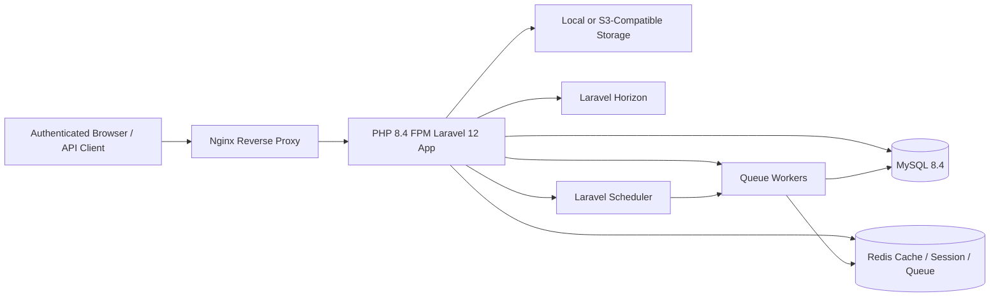
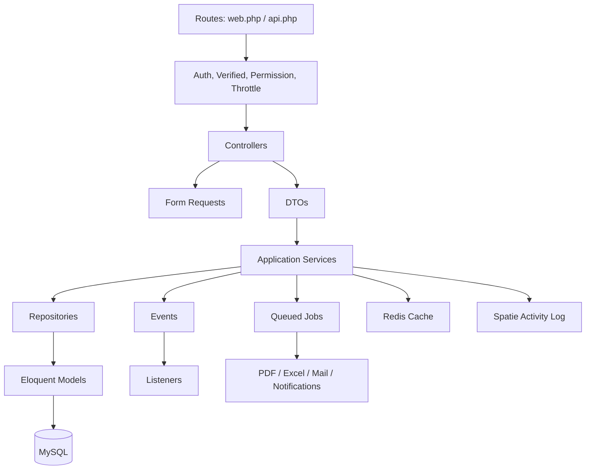
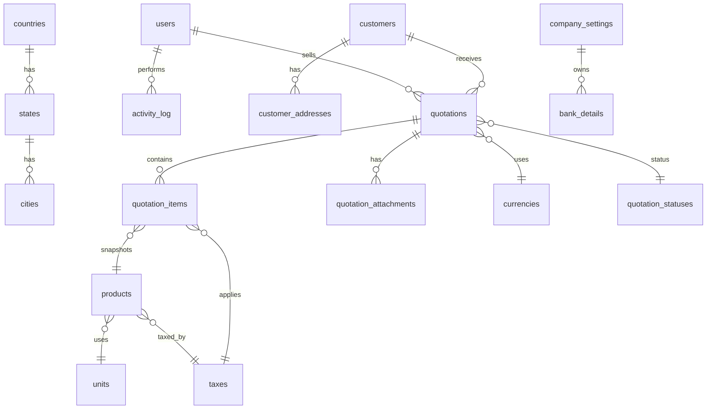

# Shree Axar Furniture Quotation ERP - Production Blueprint

## 1. Business Requirements Document (BRD)

### Business Objective
Build a secure, authenticated, ERP-grade quotation management platform for Shree Axar Furniture to centralize customers, products, masters, quotations, approvals, reporting, and auditability.

### Business Goals
- Reduce quotation preparation time through reusable masters and product pricing.
- Standardize quotation numbering, tax calculation, PDF formatting, and status tracking.
- Enforce role-based access so every feature is available only after login and authorization.
- Provide management visibility into customer growth, pending follow-ups, quotation pipeline, and projected revenue.
- Maintain complete audit trails for login, logout, create, update, delete, approval, rejection, and status changes.

### Stakeholders
| Stakeholder | Responsibility |
| --- | --- |
| Business Owner | Approves scope, workflows, tax rules, and reporting KPIs. |
| Sales Users | Create customers, products, and quotations. |
| Sales Manager | Approves/rejects quotations and monitors pipeline. |
| Admin | Manages users, roles, permissions, masters, and company settings. |
| Finance | Reviews tax summary, quotation totals, and revenue reports. |
| DevOps | Maintains Docker, deployment, backups, monitoring, and scheduler. |

### In-Scope Capabilities
- Authentication with forgot password, email verification, remember-me, and session management.
- Dashboard with statistics, charts, recent activity, and follow-ups.
- Role and permission management using Spatie Permission.
- User management with activation, password reset, roles, and profile photos.
- Company settings used automatically in quotation PDFs.
- Dynamic masters for country, state, city, address type, unit, tax, currency, bank details, and quotation status.
- Customer management with address and quotation history.
- Product management with import, export, images, taxes, units, and HSN codes.
- Quotation creation, calculation, lifecycle actions, PDF, print, duplication, and attachments.
- Audit/activity logs and reports with Excel/PDF exports.

### Out-of-Scope for Phase 1
- Full accounting ledger, inventory stock movement, purchase orders, payment collection, CRM campaigns, and mobile apps.

## 2. Product Requirements Document (PRD)

### Personas
- **Administrator:** configures users, roles, permissions, masters, settings, and backups.
- **Sales Executive:** creates customers and quotations, sends quotations, and manages follow-ups.
- **Sales Manager:** approves/rejects quotations and reviews pipeline reports.
- **Finance User:** exports revenue, tax, customer, and product reports.

### Global Rules
- No public pages except authentication endpoints needed to login, verify email, and reset passwords.
- All application routes use `auth`, `verified`, and permission middleware.
- All list screens support search, sort, pagination, and status filters.
- All destructive actions require authorization and soft deletes where business history matters.
- All file uploads validate MIME type, size, extension, and storage disk visibility.

### Functional Requirements by Module
| Module | Features | Acceptance Criteria |
| --- | --- | --- |
| Dashboard | Counts, monthly quotation chart, revenue projection, customer growth, recent records, pending follow-ups. | Authenticated users see only data permitted by role and branch/team rules when added. |
| RBAC | Create/edit/delete roles, assign permissions. | Permission changes immediately affect route and UI access. |
| Users | CRUD, activate/deactivate, reset password, assign roles, profile photo. | Inactive users cannot login; resets are logged. |
| Company Settings | Company identity, tax IDs, contact, address, banks, logo. | Latest active company settings appear in new quotation PDFs. |
| Masters | Country/state/city/address type/unit/tax/currency/bank/status CRUD. | Masters can be toggled active/inactive without breaking existing quotations. |
| Customers | CRUD, billing/shipping address, history, quotations. | Customer code is unique and immutable after quotations exist. |
| Products | CRUD, search, import/export, images. | Product code is unique; price and tax defaults copy into quotation items. |
| Quotations | Draft/save/send/approve/reject/duplicate/download/print. | Totals are deterministic and stored with line-item snapshots. |
| Audit | Log login, logout, CRUD, status changes. | Logs include actor, subject, old values, new values, IP, and user agent. |
| Reports | Quotation, customer, product, and revenue reports with Excel/PDF export. | Exports run through queues for large datasets. |

## 3. System Architecture

### High-Level Architecture Diagram


### Low-Level Architecture Diagram


### Module Architecture
- **Foundation:** authentication, authorization, shared DTOs, repositories, services, API resources, policies, traits, enums, and exceptions.
- **Administration:** users, roles, permissions, activity logs, and company settings.
- **Masters:** reusable reference data with status toggles.
- **Sales:** customers, products, quotations, quotation items, attachments, approvals, and PDF output.
- **Reporting:** dashboard metrics, exports, chart data, and scheduled summaries.
- **Infrastructure:** queues, scheduler, Redis cache, backups, media library, API docs, and Docker.

### Service Layer Design
| Service | Responsibility |
| --- | --- |
| `DashboardService` | Aggregates counts, charts, recent records, and follow-ups with cache. |
| `RolePermissionService` | Synchronizes roles and permissions. |
| `UserService` | Creates users, assigns roles, resets passwords, toggles status. |
| `CompanySettingService` | Maintains active company profile and bank details. |
| `MasterDataService` | Generic CRUD/status/search for master data. |
| `CustomerService` | Manages customer profile, addresses, and quotation history. |
| `ProductService` | Manages products, imports, exports, media, and pricing defaults. |
| `QuotationService` | Handles draft/save/send/approve/reject/duplicate workflows. |
| `QuotationCalculationService` | Calculates subtotal, item discount, global discount, tax, and grand total. |
| `ReportService` | Builds report queries and dispatches export jobs. |
| `AuditService` | Adds domain-specific properties to Spatie activity logs. |

### Repository Pattern Design
- Each aggregate has an interface in `app/Interfaces` and an implementation in `app/Repositories/Eloquent`.
- Controllers depend on services, services depend on repository interfaces, and service providers bind interfaces to implementations.
- Repositories expose query-focused methods such as `paginateForIndex`, `findForEdit`, `findWithRelations`, `create`, `update`, `delete`, and `existsByCode`.
- Business rules stay in services and actions, not repositories.

## 4. Database Design

### ER Diagram


### Core Tables
| Table | Key Columns and Constraints |
| --- | --- |
| `users` | `id` bigint PK, `name` varchar(150), `email` unique, `mobile` nullable indexed, `employee_code` nullable unique, `password`, `status` enum active/inactive default active, `profile_photo_path`, `email_verified_at`, remember token, timestamps, soft deletes. |
| `company_settings` | `id`, `company_name`, `logo_path`, `gst_number` indexed nullable, `pan_number` nullable, `email`, `mobile`, `website`, `address_line_1`, `address_line_2`, `country_id`, `state_id`, `city_id`, `postal_code`, `is_active` boolean, timestamps. |
| `countries` | `id`, `name` unique, `iso_code` varchar(3) unique, `status` boolean default true, timestamps, soft deletes. |
| `states` | `id`, `country_id` FK, `name`, `status`, unique `country_id,name`, timestamps, soft deletes. |
| `cities` | `id`, `country_id` FK, `state_id` FK, `name`, `status`, unique `state_id,name`, timestamps, soft deletes. |
| `address_types` | `id`, `name` unique, `status`, timestamps, soft deletes. |
| `units` | `id`, `name`, `code` unique, `status`, timestamps, soft deletes. |
| `taxes` | `id`, `name`, `rate` decimal(5,2), `status`, timestamps, soft deletes. |
| `currencies` | `id`, `name`, `code` char(3) unique, `symbol`, `exchange_rate` decimal(15,6) default 1, `status`, timestamps. |
| `bank_details` | `id`, `company_setting_id` nullable FK, `bank_name`, `account_name`, `account_number`, `ifsc`, `branch`, `status`, timestamps, soft deletes. |
| `quotation_statuses` | `id`, `name` unique, `slug` unique, `color`, `sort_order`, `is_final` boolean, `status`, timestamps. |
| `customers` | `id`, `customer_code` unique, `company_name`, `contact_person`, `email` indexed, `mobile` indexed, `gst_number`, `pan_number`, `country_id`, `state_id`, `city_id`, `status`, timestamps, soft deletes. |
| `customer_addresses` | `id`, `customer_id` FK, `address_type_id` FK, `address_line_1`, `address_line_2`, `country_id`, `state_id`, `city_id`, `postal_code`, `is_default`, timestamps. |
| `products` | `id`, `product_code` unique, `product_name`, `description`, `category`, `unit_id` FK, `hsn_code`, `tax_id` FK, `base_price` decimal(15,2), `status`, timestamps, soft deletes. |
| `quotations` | `id`, `quotation_number` unique, `customer_id` FK, `quotation_date`, `valid_till`, `sales_person_id` FK users, `currency_id` FK, `quotation_status_id` FK, `sub_total`, `item_discount_total`, `global_discount_type`, `global_discount_value`, `global_discount_amount`, `tax_total`, `grand_total`, `notes`, `terms_conditions`, timestamps, soft deletes. |
| `quotation_items` | `id`, `quotation_id` FK, `product_id` nullable FK, `product_code_snapshot`, `description`, `quantity` decimal(12,3), `unit_id` FK, `rate`, `discount_type`, `discount_value`, `discount_amount`, `tax_id` nullable FK, `tax_rate_snapshot`, `tax_amount`, `line_total`, `sort_order`, timestamps. |
| `quotation_attachments` | `id`, `quotation_id` FK, `media_id` nullable, `file_name`, `file_path`, `mime_type`, `size`, timestamps. |
| `follow_ups` | `id`, `quotation_id` FK, `assigned_to` FK users, `due_at`, `notes`, `status` enum pending/completed/cancelled, timestamps. |

### Indexing Strategy
- Unique indexes on business codes: `customer_code`, `product_code`, `quotation_number`, `employee_code`, `currency.code`.
- Composite search indexes on `customers(company_name,email,mobile)`, `products(product_name,product_code)`, and `quotations(quotation_date,quotation_status_id,sales_person_id)`.
- Foreign key indexes on every `*_id` column.
- Report indexes on dates, statuses, and sales person columns.

### Migration Structure
Recommended migration order:
1. Laravel auth tables, cache, jobs, failed jobs, and personal access tokens if API tokens are added.
2. Spatie permission tables.
3. Spatie activity log tables.
4. Master tables: countries, states, cities, address types, units, taxes, currencies, bank details, quotation statuses.
5. Company settings.
6. Customers and customer addresses.
7. Products.
8. Quotations, quotation items, quotation attachments, and follow-ups.
9. Seeders for default roles, permissions, statuses, tax rates, address types, and units.

## 5. Docker Setup

### Containers
- `nginx`: reverse proxy serving `public/` and forwarding PHP requests to PHP-FPM.
- `app`: PHP 8.4-FPM runtime for Laravel 12.
- `mysql`: MySQL 8.4 database with persistent volume.
- `redis`: Redis 7.4 for cache, sessions, queues, and Horizon.
- `queue`: Laravel queue worker using Redis.
- `scheduler`: runs `php artisan schedule:run` every minute.

### Files Added
- `docker/php/Dockerfile` installs PHP 8.4 extensions, Redis extension, Composer, Node.js, npm, and creates a non-root Laravel user.
- `docker/php/opcache.ini` enables development-friendly OPcache settings.
- `docker/nginx/default.conf` secures the Nginx virtual host and forwards PHP to the app container.
- `docker-compose.yml` defines app, nginx, mysql, redis, queue, scheduler, volumes, and network.
- `.env.example` includes Laravel, MySQL, Redis, queue, session, mail, and Docker port defaults.

### Development Commands
```bash
cp .env.example .env
docker compose build
docker compose up -d
docker compose exec app composer create-project laravel/laravel:^12.0 . --prefer-dist
docker compose exec app php artisan key:generate
docker compose exec app php artisan migrate --seed
docker compose exec app npm install
docker compose exec app npm run dev
```

### Restart and Maintenance Commands
```bash
docker compose restart
docker compose logs -f app nginx mysql redis
docker compose exec app php artisan optimize:clear
docker compose exec app php artisan queue:restart
docker compose exec app php artisan horizon:status
```

### Deployment Commands
```bash
git pull origin main
docker compose build --pull
docker compose up -d --remove-orphans
docker compose exec app composer install --no-dev --optimize-autoloader
docker compose exec app npm ci
docker compose exec app npm run build
docker compose exec app php artisan migrate --force
docker compose exec app php artisan config:cache
docker compose exec app php artisan route:cache
docker compose exec app php artisan view:cache
docker compose exec app php artisan queue:restart
```

## 6. Laravel Folder Structure

```text
app/
├── Actions/
├── DTO/
├── Enums/
├── Events/
├── Exceptions/
├── Helpers/
├── Http/
│   ├── Controllers/
│   │   ├── Api/V1/
│   │   └── Web/
│   ├── Middleware/
│   ├── Requests/
│   └── Resources/
├── Interfaces/
├── Jobs/
├── Listeners/
├── Models/
├── Notifications/
├── Policies/
├── Providers/
├── Repositories/
│   └── Eloquent/
├── Services/
├── Support/
└── Traits/
database/
├── factories/
├── migrations/
└── seeders/
resources/
├── js/
├── views/
│   ├── auth/
│   ├── dashboard/
│   ├── masters/
│   ├── users/
│   ├── customers/
│   ├── products/
│   ├── quotations/
│   └── reports/
routes/
├── api.php
├── auth.php
├── console.php
└── web.php
```

### Frontend Recommendation
Use Vue.js for interactive quotation line items, totals, product lookup, and dynamic address selection; keep Blade as the layout shell for fast Laravel-native delivery. Bootstrap 5 can provide the design system.

## 7. API Design

### API Standards
- Prefix: `/api/v1`.
- Authentication: session for web, Sanctum token only if external integrations are needed.
- Response envelope: `{ "data": {}, "meta": {}, "message": "" }`.
- Validation errors: Laravel JSON validation format.
- Pagination: `per_page` capped at 100.
- Filtering: query params such as `search`, `status`, `date_from`, `date_to`, `customer_id`, and `sales_person_id`.

### REST Endpoints
| Resource | Endpoints |
| --- | --- |
| Dashboard | `GET /dashboard/summary`, `GET /dashboard/charts/monthly-quotations`, `GET /dashboard/widgets` |
| Roles | `GET/POST /roles`, `GET/PUT/DELETE /roles/{role}`, `POST /roles/{role}/permissions` |
| Users | `GET/POST /users`, `GET/PUT/DELETE /users/{user}`, `POST /users/{user}/activate`, `POST /users/{user}/deactivate`, `POST /users/{user}/reset-password` |
| Company Settings | `GET /company-settings`, `PUT /company-settings`, `POST /company-settings/logo` |
| Masters | `GET/POST /masters/{type}`, `GET/PUT/DELETE /masters/{type}/{id}`, `PATCH /masters/{type}/{id}/toggle-status` |
| Customers | `GET/POST /customers`, `GET/PUT/DELETE /customers/{customer}`, `GET /customers/{customer}/quotations`, `GET /customers/{customer}/history` |
| Products | `GET/POST /products`, `GET/PUT/DELETE /products/{product}`, `POST /products/import`, `GET /products/export` |
| Quotations | `GET/POST /quotations`, `GET/PUT/DELETE /quotations/{quotation}`, `POST /quotations/{quotation}/send`, `POST /quotations/{quotation}/approve`, `POST /quotations/{quotation}/reject`, `POST /quotations/{quotation}/duplicate`, `GET /quotations/{quotation}/pdf`, `GET /quotations/{quotation}/print` |
| Reports | `GET /reports/quotations`, `GET /reports/customers`, `GET /reports/products`, `GET /reports/revenue`, `POST /reports/{type}/exports` |

## 8. Required Packages and Installation

### Installation Commands
```bash
docker compose exec app composer require laravel/breeze spatie/laravel-permission spatie/laravel-activitylog spatie/laravel-backup spatie/laravel-medialibrary maatwebsite/excel dedoc/scramble laravel/telescope laravel/horizon barryvdh/laravel-dompdf
docker compose exec app php artisan breeze:install vue
docker compose exec app php artisan vendor:publish --provider="Spatie\Permission\PermissionServiceProvider"
docker compose exec app php artisan vendor:publish --provider="Spatie\Activitylog\ActivitylogServiceProvider"
docker compose exec app php artisan vendor:publish --provider="Spatie\Backup\BackupServiceProvider"
docker compose exec app php artisan vendor:publish --provider="Spatie\MediaLibrary\MediaLibraryServiceProvider" --tag="medialibrary-migrations"
docker compose exec app php artisan horizon:install
docker compose exec app php artisan telescope:install
docker compose exec app php artisan migrate
```

### Package Rationale
| Package | Why It Is Needed |
| --- | --- |
| Laravel Breeze | Lightweight authentication scaffolding with login, registration control, password reset, email verification, and Vue option. |
| Spatie Permission | Mature RBAC package for roles, permissions, middleware, and policy integration. |
| Spatie Activity Log | Tracks auditable user and model actions with before/after properties. |
| Spatie Backup | Schedules application and database backups. |
| Spatie Media Library | Manages company logos, profile photos, product images, and quotation attachments. |
| Laravel Excel | Imports products and exports reports to Excel. |
| Scramble | Generates API documentation from Laravel routes and resources. |
| Laravel Telescope | Local/staging debugging for requests, queries, queues, mail, and logs. |
| Laravel Horizon | Redis queue dashboard, worker balancing, retry visibility, and metrics. |
| DomPDF | Generates professional quotation PDF documents. |

## 9. Development Roadmap

| Phase | Features | Tasks | Dependencies | Estimate | Deliverables |
| --- | --- | --- | --- | --- | --- |
| 1. Project Setup | Laravel 12, Docker, Git, CI baseline. | Install Laravel, configure env, Docker, code style, base layout. | None | 3-5 days | Running app, Docker stack, README. |
| 2. Authentication | Login, forgot password, email verification, remember me. | Install Breeze, disable public registration if admin-only, session policies. | Phase 1 | 2-3 days | Secure auth flow. |
| 3. Role Permission | RBAC. | Install Spatie Permission, seed permissions, middleware, policies. | Phase 2 | 3-4 days | Role screens and permission checks. |
| 4. Masters | All dynamic masters. | Migrations, models, CRUD, status toggle, seeders. | Phase 3 | 5-7 days | Master admin panel and APIs. |
| 5. Users | User admin. | CRUD, roles, status, reset password, media. | Phase 3 | 3-4 days | User management. |
| 6. Customers | Customer master and addresses. | CRUD, addresses, history, quotation relation. | Phase 4 | 4-6 days | Customer module. |
| 7. Products | Product master. | CRUD, image, import/export, taxes/units. | Phase 4 | 4-6 days | Product module. |
| 8. Quotations | Core quotation lifecycle. | Header/items, calculation service, statuses, approvals, PDF, duplicate. | Phases 4-7 | 10-15 days | Complete quotation module. |
| 9. Reports | Reports and exports. | Query reports, charts, Excel/PDF queued exports. | Phase 8 | 5-7 days | Reporting dashboard and exports. |
| 10. Deployment | Production hardening. | Nginx, SSL, env, backups, scheduler, Horizon, monitoring. | All | 3-5 days | Production deployment package. |

## 10. Sprint Planning

### Sprint 1: Foundation
- Docker and Laravel installation.
- Authentication scaffolding.
- Base UI shell, navigation, route guards.
- CI checks: tests, Pint, PHPStan/Larastan.

### Sprint 2: Administration
- Spatie roles and permissions.
- User management.
- Company settings.
- Activity log baseline.

### Sprint 3: Masters
- Country, state, city, address type, unit, tax, currency, bank details, quotation statuses.
- Shared master CRUD components and API resources.

### Sprint 4: Customers and Products
- Customer module with addresses and quotation history.
- Product module with images, import, export, and tax/unit defaults.

### Sprint 5: Quotation Core
- Quotation header/items UI.
- Calculation service and DTOs.
- Save draft, send, approve, reject, duplicate, status timeline.

### Sprint 6: PDF, Reports, and Hardening
- PDF quotation template.
- Dashboard charts and reports.
- Queued exports, backups, Horizon, scheduler, authorization test coverage.

## 11. Database Migrations

### Example: Quotations Migration Skeleton
```php
Schema::create('quotations', function (Blueprint $table) {
    $table->id();
    $table->string('quotation_number')->unique();
    $table->foreignId('customer_id')->constrained()->restrictOnDelete();
    $table->date('quotation_date');
    $table->date('valid_till');
    $table->foreignId('sales_person_id')->constrained('users')->restrictOnDelete();
    $table->foreignId('currency_id')->constrained()->restrictOnDelete();
    $table->foreignId('quotation_status_id')->constrained()->restrictOnDelete();
    $table->decimal('sub_total', 15, 2)->default(0);
    $table->decimal('item_discount_total', 15, 2)->default(0);
    $table->string('global_discount_type')->nullable();
    $table->decimal('global_discount_value', 15, 2)->default(0);
    $table->decimal('global_discount_amount', 15, 2)->default(0);
    $table->decimal('tax_total', 15, 2)->default(0);
    $table->decimal('grand_total', 15, 2)->default(0);
    $table->text('notes')->nullable();
    $table->text('terms_conditions')->nullable();
    $table->timestamps();
    $table->softDeletes();

    $table->index(['quotation_date', 'quotation_status_id']);
    $table->index(['sales_person_id', 'quotation_date']);
});
```

### Example: Quotation Items Migration Skeleton
```php
Schema::create('quotation_items', function (Blueprint $table) {
    $table->id();
    $table->foreignId('quotation_id')->constrained()->cascadeOnDelete();
    $table->foreignId('product_id')->nullable()->constrained()->nullOnDelete();
    $table->string('product_code_snapshot')->nullable();
    $table->text('description');
    $table->decimal('quantity', 12, 3);
    $table->foreignId('unit_id')->constrained()->restrictOnDelete();
    $table->decimal('rate', 15, 2);
    $table->string('discount_type')->nullable();
    $table->decimal('discount_value', 15, 2)->default(0);
    $table->decimal('discount_amount', 15, 2)->default(0);
    $table->foreignId('tax_id')->nullable()->constrained()->nullOnDelete();
    $table->decimal('tax_rate_snapshot', 5, 2)->default(0);
    $table->decimal('tax_amount', 15, 2)->default(0);
    $table->decimal('line_total', 15, 2)->default(0);
    $table->unsignedInteger('sort_order')->default(0);
    $table->timestamps();
});
```

## 12. Model Relationships

| Model | Relationships |
| --- | --- |
| `User` | `hasMany(Quotation::class, 'sales_person_id')`, Spatie `HasRoles`, media for profile photo. |
| `CompanySetting` | `belongsTo(Country/State/City)`, `hasMany(BankDetail::class)`, media for logo. |
| `Country` | `hasMany(State::class)`, `hasMany(City::class)`. |
| `State` | `belongsTo(Country::class)`, `hasMany(City::class)`. |
| `City` | `belongsTo(Country::class)`, `belongsTo(State::class)`. |
| `Customer` | `belongsTo(Country/State/City)`, `hasMany(CustomerAddress::class)`, `hasMany(Quotation::class)`. |
| `Product` | `belongsTo(Unit::class)`, `belongsTo(Tax::class)`, media for images. |
| `Quotation` | `belongsTo(Customer::class)`, `belongsTo(User::class, 'sales_person_id')`, `belongsTo(Currency::class)`, `belongsTo(QuotationStatus::class)`, `hasMany(QuotationItem::class)`, `hasMany(QuotationAttachment::class)`. |
| `QuotationItem` | `belongsTo(Quotation::class)`, `belongsTo(Product::class)`, `belongsTo(Unit::class)`, `belongsTo(Tax::class)`. |
| `FollowUp` | `belongsTo(Quotation::class)`, `belongsTo(User::class, 'assigned_to')`. |

## 13. Permission Matrix

| Module | View | Create | Edit | Delete | Export | Approve |
| --- | --- | --- | --- | --- | --- | --- |
| Dashboard | `dashboard.view` | - | - | - | - | - |
| Roles | `roles.view` | `roles.create` | `roles.edit` | `roles.delete` | - | - |
| Users | `users.view` | `users.create` | `users.edit` | `users.delete` | `users.export` | - |
| Company Settings | `company-settings.view` | - | `company-settings.edit` | - | - | - |
| Masters | `masters.view` | `masters.create` | `masters.edit` | `masters.delete` | `masters.export` | - |
| Customers | `customers.view` | `customers.create` | `customers.edit` | `customers.delete` | `customers.export` | - |
| Products | `products.view` | `products.create` | `products.edit` | `products.delete` | `products.export` | - |
| Quotations | `quotations.view` | `quotations.create` | `quotations.edit` | `quotations.delete` | `quotations.export` | `quotations.approve` |
| Reports | `reports.view` | - | - | - | `reports.export` | - |
| Activity Logs | `activity-logs.view` | - | - | - | `activity-logs.export` | - |

### Default Roles
| Role | Permission Scope |
| --- | --- |
| Super Admin | All permissions; cannot be deleted from UI. |
| Admin | User, role, master, company, customer, product, quotation, and report administration. |
| Sales Manager | Customer/product view, quotation create/edit/approve/export, reports. |
| Sales Executive | Customer create/edit, product view, quotation create/edit/send, own reports. |
| Finance | Quotation view/export, reports view/export. |

## 14. Security, Performance, and Standards

### Security Requirements
- Use Laravel CSRF protection for all web forms.
- Use Blade escaping and Vue binding rules to prevent XSS.
- Use Eloquent/query builder parameter binding to prevent SQL injection.
- Add permission middleware to every protected route.
- Enforce password policy: minimum 12 chars, mixed case, number, symbol, uncompromised password validation.
- Use email verification for active users.
- Store uploads outside public paths unless intentionally published through signed URLs.
- Validate image/document MIME types and file sizes.
- Log sensitive actions with actor, IP, user agent, subject, and before/after values.
- Enable rate limiting on login, password reset, API, and exports.

### Performance Requirements
- Pagination on every index endpoint and screen.
- Eager-load known relations in list and detail views.
- Cache dashboard metrics and master dropdown data in Redis.
- Queue PDF generation, Excel exports, email sending, and backups.
- Use database indexes for search, filters, foreign keys, and reports.
- Use chunked imports and exports for large product/report data.

### Laravel Development Standards
- Controllers are thin and delegate to services.
- Form Requests own validation and authorization.
- DTOs transfer validated data into services.
- Services enforce business rules and transactions.
- Repositories encapsulate query construction.
- Policies and permissions gate every module.
- Events/listeners handle side effects such as audit entries, notifications, and exports.
- Jobs perform heavy operations asynchronously.
- API Resources shape JSON responses consistently.

## 15. Testing Strategy

### Unit Tests
- `QuotationCalculationServiceTest`: subtotal, item discount, global discount, tax, grand total, rounding.
- `PermissionMatrixTest`: seeded permissions and role assignments.
- `QuotationNumberGeneratorTest`: uniqueness and format.

### Feature Tests
- Authentication and email verification.
- Permission denied/allowed access per role.
- Master CRUD and status toggle.
- Customer CRUD with addresses.
- Product CRUD, import, export.
- Quotation lifecycle: draft, send, approve, reject, duplicate.
- PDF endpoint requires permission.
- Report filters and queued export dispatch.

### Integration Tests
- Redis queue job dispatch and completion.
- Excel import/export with sample files.
- Media upload validation and storage.
- Scheduler triggers backups and report jobs.

### Quality Commands
```bash
docker compose exec app php artisan test
docker compose exec app ./vendor/bin/pint --test
docker compose exec app ./vendor/bin/phpstan analyse
docker compose exec app php artisan route:list
docker compose exec app php artisan migrate:fresh --seed
```

## 16. Deployment Guide

### Server Prerequisites
- Linux host with Docker Engine and Docker Compose plugin.
- Domain name and TLS certificate through reverse proxy or load balancer.
- Persistent disk for MySQL and Redis volumes.
- Off-host backup target such as S3-compatible storage.
- SMTP credentials for password reset and notifications.

### Production Steps
1. Clone repository to the deployment directory.
2. Copy `.env.example` to `.env` and set production secrets.
3. Set `APP_ENV=production`, `APP_DEBUG=false`, secure `APP_KEY`, database passwords, Redis password, mail credentials, and backup disk.
4. Build and start containers.
5. Install optimized Composer dependencies.
6. Build frontend assets.
7. Run migrations with `--force`.
8. Cache config, routes, and views.
9. Start queue workers/Horizon and scheduler.
10. Verify health checks, logs, backups, and TLS.

## 17. Production Checklist

### Application
- [ ] `APP_ENV=production` and `APP_DEBUG=false`.
- [ ] Strong `APP_KEY`, database password, Redis password, and mail credentials.
- [ ] HTTPS enforced at proxy/load balancer.
- [ ] Registration disabled unless explicitly required.
- [ ] All routes protected by auth/verified/permission middleware.
- [ ] Telescope disabled or restricted outside local/staging.

### Database and Backups
- [ ] MySQL persistent volume configured.
- [ ] Daily automated backups configured and tested.
- [ ] Restore drill completed.
- [ ] Migration rollback plan documented.

### Queue and Scheduler
- [ ] Horizon running and monitored.
- [ ] Scheduler container running exactly once per environment.
- [ ] Failed job alerting configured.

### Security
- [ ] Upload file limits configured in Nginx and Laravel validation.
- [ ] Rate limits configured for auth, API, and exports.
- [ ] Audit logs enabled for critical models.
- [ ] Least-privilege roles assigned.

### Observability
- [ ] Centralized logs configured.
- [ ] Error tracking configured.
- [ ] Uptime checks configured.
- [ ] Disk, CPU, memory, MySQL, Redis, and queue metrics monitored.
